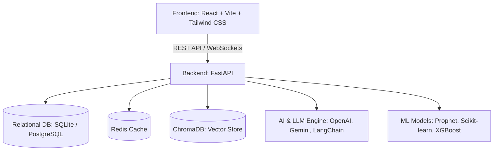

# AI Personal Finance MCP

## Summary
AI Personal Finance MCP is an intelligent, comprehensive personal finance management application that leverages Machine Learning and Large Language Models (LLMs) to provide actionable insights, predictive analytics, and smart financial advice. It helps users track expenses, plan budgets, and forecast future financial trends using state-of-the-art AI technologies.

## Architecture



## Tech Stack

### Frontend
- **Framework:** React 19 with Vite
- **Styling:** Tailwind CSS, Framer Motion for animations
- **Routing & State:** React Router DOM, React Query (@tanstack/react-query)
- **Data Visualization:** Recharts

### Backend
- **Framework:** FastAPI (Python)
- **Database ORM:** SQLAlchemy, Alembic (supports SQLite/PostgreSQL)
- **AI / LLMs:** OpenAI, Google Generative AI (Gemini), LangChain, ChromaDB
- **Machine Learning:** Prophet, Scikit-learn, XGBoost, Pandas, Numpy
- **Authentication:** Python-jose, Passlib
- **Caching:** Redis

## Features and Workflows

1. **Dashboard & Tracking:** Visual dashboard for tracking income, expenses, and overall financial health.
2. **AI-Driven Categorization:** Automatically categorizes transactions using LLMs.
3. **Predictive Analytics:** Uses ML models like Prophet and XGBoost to forecast future spending, cash flows, and help plan budgets effectively.
4. **Financial Chatbot:** An intelligent assistant powered by OpenAI/Gemini that answers questions about your finances and gives personalized advice based on your data stored in ChromaDB.
5. **Goal Planning:** Create savings goals and track your progress with AI-assisted recommendations.

## Installation and Setup

### Prerequisites
- Python 3.9+
- Node.js 18+
- Redis (optional, for caching)
- API Keys for OpenAI / Google Gemini

### Backend Setup
1. Navigate to the backend directory:
   ```bash
   cd backend
   ```
2. Create and activate a virtual environment:
   ```bash
   python -m venv venv
   # On Windows:
   venv\Scripts\activate
   # On macOS/Linux:
   source venv/bin/activate
   ```
3. Install dependencies:
   ```bash
   pip install -r requirements.txt
   ```
4. Create a `.env` file in the `backend` directory and add your API keys.
5. Run the FastAPI development server:
   ```bash
   uvicorn app.main:app --reload
   ```

### Frontend Setup
1. Navigate to the frontend directory:
   ```bash
   cd frontend
   ```
2. Install dependencies:
   ```bash
   npm install
   ```
3. Start the Vite development server:
   ```bash
   npm run dev
   ```

## Developer Details
- **Name:** Shaurya Bandari
- **Email:** [shaurya170705@gmail.com](mailto:shaurya170705@gmail.com)
